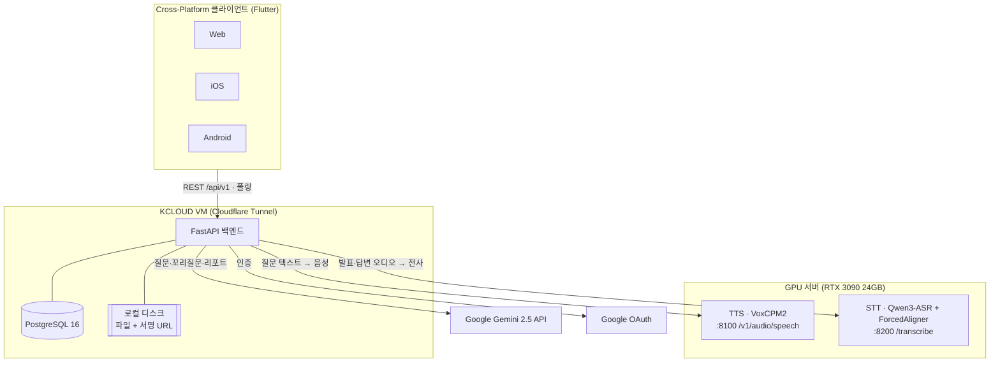

# 26s-w2-c1-02

## 공통과제 II : 협업형 실전 산출물 제작 (2인 1팀)

**목적:** 실시간 인터랙션, LLM Wrapper, Cross-Platform 중 하나의 옵션을 선택해 구현하며, 선택한 기술을 실제로 동작하는 형태의 산출물로 완성한다.

**선택 옵션:**

| 옵션 | 설명 |
|---|---|
| 실시간 인터랙션 | 사용자 간 상태 변화, 실시간 데이터 흐름, 스트리밍 응답 등 실시간성이 드러나는 기능을 구현 |
| LLM Wrapper | LLM API를 활용하여 AI 기능이 포함된 산출물을 구현 |
| Cross-Platform | 하나의 산출물을 여러 실행 환경에서 사용할 수 있도록 구현* |

> *데스크톱 앱 ↔ 모바일 앱; 혹은 다른 폼팩터에서의 앱; 웹만/웹 기반 프레임워크(Electron, Tauri 등) 대신 다른 프레임워크를 시도해보는 것을 적극 권장

**결과물:** 선택한 옵션이 적용된 작동 가능한 산출물, 실행 가능한 코드, 시연 자료 및 관련 문서

---

## 팀원

| 이름 | 학교 | GitHub | 역할 |
|---|---|---|---|
| 박준서 | 한양대학교 | [bjsbest](https://github.com/bjsbest) | Frontend |
| 이서진 | KAIST | [seojinnlee](https://github.com/seojinnlee) | AI Pipeline |
| 정서영 | 부산대학교 | [seooyy](https://github.com/seooyy) | Backend |

---

## 선택 옵션

- [ ] 실시간 인터랙션
- [x] LLM Wrapper
- [x] Cross-Platform

---

## 기획안

- **산출물 주제:**
AI 청중과 실시간 음성으로 대화하는 발표 리허설 서비스. 사용자가 프레젠테이션 자료와 발표음성을 올리고 발표 유형(대학 팀플, IR 피칭, 임원 보고, PT 면접)과 청중 페르소나를 선택하면, LLM 기반 가상 청중이 생성한 질문을 TTS로 음성 출력하고, 사용자의 음성 답변을 STT로 텍스트 변환해 LLM에 전달하는 방식으로 실제 질의응답처럼 주고받는 음성 시뮬레이션을 제공하며, 발표 기록을 바탕으로 발표 습관·강점·약점을 분석한 성장 리포트까지 제공하는 발표 준비 보조 플랫폼.

- **제작 목적:**
발표 연습의 핵심은 실제 청중의 반응과 예상치 못한 질문에 즉석에서 말로 대응하는 경험이지만, 혼자 하는 리허설로는 이를 얻기 어렵다. 다양한 성향의 AI 청중 페르소나가 던지는 질문을 TTS로 직접 듣고, 사용자가 말로 답하면 STT로 변환된 답변을 LLM이 이해해 꼬리 질문을 이어가는 음성 기반 질의응답 루프를 구현함으로써, 텍스트 채팅이 아닌 실전과 동일한 '듣고 말하는' 리허설 환경을 제공한다. 나아가 축적된 발표·답변 기록을 분석해 "어떤 질문에 강하고 약한지", 자신의 발표 스타일이 어떤지에 대한 인사이트와 성장 리포트를 제공하여 사용자의 발표 역량을 체계적으로 성장시키는 것이 목적이다. 이 과정에서 LLM·TTS·STT API를 결합한 음성 대화 파이프라인을 여러 실행 환경에서 사용할 수 있는 형태로 구현한다.

- **선택 옵션:** LLM Wrapper + Cross-Platform
  - **LLM Wrapper:** Google Gemini 2.5 API로 페르소나별 예상 질문·꼬리질문 생성과 발표 분석 리포트를 수행하고, GPU 서버의 STT(Qwen3-ASR)·TTS(VoxCPM2)와 결합해 음성 질의응답 파이프라인을 구성한다.
  - **Cross-Platform:** Flutter 단일 코드베이스로 Web · iOS · Android를 동시 지원한다(웹 기반 프레임워크 대신 네이티브 크로스플랫폼 프레임워크 채택).

- **핵심 구현 요소:**
  - **음성 질의응답 루프 (프로젝트의 심장):** 발표 녹음 STT → 슬라이드·전사·페르소나 기반 LLM 질문 생성 → 질문 TTS 재생 → 답변 자동 녹음 → 답변 STT → 꼬리질문(깊이 1) 판정으로 이어지는 '듣고 말하는' 티키타카. 무거운 단계는 전부 비동기(`202` 접수 + 폴링)로 처리.
  - **AI 청중 페르소나 질문 생성:** 5종 페르소나(에겐·테토·꼰대·멍청·잼민)와 4종 질문 전략(디테일 추궁·큰그림·기초개념·수치검증)으로 질문을 만들고, 각 질문에 근거(슬라이드 번호·전사 타임스탬프)를 부여. 선택한 페르소나는 질의 수에 걸쳐 균등 랜덤 배분(예: 5문항·3페르소나 → 2/2/1).
  - **발표 세션 기록 & 분석·성장 리포트:** 슬라이드·전사·Q&A 로그를 세션 단위로 영속화하고, 전략별 답변 점수·WPM·필러워드로 단일 세션 리포트와 회차 비교 성장 리포트를 생성.
- **사용 / 시연 시나리오:**
  1. 로그인 후 팀을 만들고 팀원을 초대한다(이메일 / 링크).
  2. 발표 세션을 생성하며 PDF 자료를 업로드하고, 페르소나·질의 수·제한시간을 설정한다.
  3. 발표를 녹음(또는 파일 업로드)하면 STT로 전사되고, AI가 슬라이드·전사 기반 질문을 생성한다.
  4. 질문이 페르소나 음성(TTS)으로 재생되고, 사용자가 말로 답하면 답변이 전사되어 꼬리질문으로 이어진다.
  5. 질의응답 종료 시 분석 리포트가 자동 생성되고, 마이페이지에서 회차별 성장 리포트를 확인한다.
- **팀원별 역할:**
  - **박준서 (Frontend):** Flutter 28화면, 상태관리, 폴링 UX, 오디오 녹음/재생, Mock → 실API 전환
  - **정서영 (Backend Core):** FastAPI + PostgreSQL, 인증(JWT)/팀/초대/세션 CRUD, 상태머신, 파일 스토리지, 배포
  - **이서진 (AI Pipeline):** GPU 서버(STT/TTS) 운영·연동, PDF 파싱, Gemini 2.5 질문·꼬리질문·리포트 프롬프트, 정량 지표
  > 상세 워크플로우·경계 규칙은 [docs/workflow.md](docs/workflow.md) 참고.

### 개발 일정

| 날짜 | 목표 |
|---|---|
| Day 1 | 주제 선정 |
| Day 2 | 와이어 프레임, 주제 구체화  |
| Day 3 | **Step 1 — 기반 구축**: DB(PostgreSQL 16 DDL)·인증(JWT)·팀 CRUD, FE 데이터 모델·라우트 골격·폴링 위젯, GPU 셋업·페르소나 voice design 착수, Gemini 연결 |
| Day 4 | **Step 2 — 자료·녹음 파이프라인**: 세션 상태머신, PDF 파싱, 녹음 중 1분 청크 전송·STT 병합, 발표 준비/녹음 화면 |
| Day 5 | **Step 3 — Q&A 루프(심장)**: 질문·꼬리질문 프롬프트, 질문 TTS, 답변 비동기(202+폴링), 질의응답 화면 |
| Day 6 | **Step 4 — 리포트 + 실물 통합**: 정량 지표·리포트 LLM, 리포트 API, Mock-off E2E, 크로스플랫폼 검증 |
| Day 7 | **Step 5 — 안정화 + 시연 준비**: 에러/재시도 UX, 시드·데모 계정, 레이트리밋 최소 방어, README 마무리, 시연 영상 |

---

## 구현 명세서

| 구현 요소 | 설명 | 우선순위 |
|---|---|---|
| 음성 질의응답 루프 | STT → LLM 질문 생성 → TTS 재생 → 답변 STT → 꼬리질문(깊이 1). 무거운 단계는 `202` + 폴링 | 필수 |
| AI 페르소나 질문 생성 + 근거 표시 | 5종 페르소나 · 4종 전략, 근거(슬라이드·전사 ts), 질의 수 균등 랜덤 배분 | 필수 |
| 발표 세션 기록 & 분석·성장 리포트 | 세션 영속화, 전략별 답변 점수·WPM·필러워드, 회차 비교 성장 리포트 | 필수 |
| 인증·팀·세션 관리 | JWT(Web 쿠키 / Native 본문), 팀·초대·승계, 세션 CRUD·상태머신 | 필수 |
| 소셜 로그인 (구글 1종) | Google OAuth 연동. 카카오/네이버는 자리만, 이메일 인증은 코드 저장만(발송 생략) | 선택 |
| 실시간 진행률 (SSE/WebSocket) | 질문 생성·TTS 대기 등 진행률 push. 미도입 시 폴링 폴백 유지 | 선택 |
| ~~실존 인물 목소리 클로닝 (Qwen3-TTS)~~ | 이번 범위에서 **제외 확정**. TTS는 VoxCPM2 페르소나 음성으로 일원화 | 제외 |

---

## 아키텍처

<!-- LLM Wrapper: API 연동 흐름도 / Cross-Platform: 플랫폼 구성도 -->



> **비동기 원칙:** PDF 파싱·STT·질문 생성·TTS·리포트 등 무거운 작업은 즉시 `202`로 접수하고, 클라이언트가 리소스 상태(`queued|processing|ready|failed`)를 1~2초 간격으로 폴링해 결과를 확인한다. 특히 답변 제출은 꼬리질문을 즉시 반환하지 않고 `GET /qna` 폴링으로 확정한다. (계약: [docs/api-spec.md](docs/api-spec.md) §1.2, §4.4)

### 발표 녹음 → STT 청크 파이프라인

발표 녹음은 실시간 스트리밍이 아니라 **녹음 중 약 1분 청크를 순차 전송**해, 발표가 끝나기 전에 전사가 대부분 진행되도록 한다. 경계 단어 잘림은 겹침 + 서버 병합으로 방지한다.

- **청크 생성 (박준서 · FE):** 고정 ~60초 + **3~5초 겹침(overlap)**, 순번·녹음 오프셋을 실어 순서대로 업로드 (별도 VAD 없이 단순 버퍼링). 재생용 전체 파일도 종료 시 확보.
- **큐·상태 (정서영 · BE):** 청크 수신 → **직렬 STT 잡 큐**(순서 보장) → `transcript` 상태 관리, 재생용 전체 파일 조립.
- **병합 (이서진 · AI, 최난도):** 청크별 STT 결과를 **오프셋 보정 + 겹침 구간의 침묵 이음새 선택 + 중복 제거**로 합침(ForcedAligner 타임스탬프 활용).

> **불변 조건:** 청크 STT 처리시간 < 청크 길이여야 60분 발표에서 백로그가 쌓이지 않는다(Day 3 실측으로 청크 길이 확정). 답변 오디오는 짧으므로 청크 없이 단발 업로드.

---

## 설계 문서

> 프로젝트 성격에 따라 필요한 항목만 작성

### 화면 / 인터페이스 설계

- Figma 기반 **28화면**(인증·메인·팀·발표준비·발표·질의응답·이전발표·분석·마이페이지·공통 10그룹). 편집 가능한 와이어프레임 SVG는 [design/wireframes/](design/wireframes/)에 있으며 Figma로 드래그해 사용.
- 화면 ↔ 라우트 매핑과 Flutter 구조는 [frontend/README.md](frontend/README.md) 참고.
- 계층: **팀 > 세션(발표 1회)** 2계층. 회차 비교는 성장 리포트에서 처리(2026-07-10 확정).

### 데이터 구조

- **DBMS:** PostgreSQL 16 — 테이블 **16개**, ENUM **12종**, `updated_at` 트리거. 전체 DDL·ERD는 [docs/db-schema.md](docs/db-schema.md).
- **PK 전략:** prefix 문자열 + base62 랜덤 20자 (`usr_`, `team_`, `ses_`, `q_` 등). 1:1 자식 테이블(materials/recordings/transcripts/reports/answers)은 부모 PK 재사용.
- **혼합 저장(D3):** 대용량·가변 구조는 JSONB (`materials.slides`, `transcripts.segments`, `questions.evidence`, `reports.filler_words`), 관계·집계 축은 정규화 테이블(질문·답변·전략별 점수).
- **파일 저장(A10 확정):** KCLOUD VM **로컬 디스크** + 서명 URL 흉내(`*_url`은 요청 시 발급). DB에는 `storage_key`(경로)만 저장하며 **보관 무기한**(별도 정책 없음). 경로 규약 예: `sessions/{session_id}/recording.m4a`, `sessions/{session_id}/tts/{question_id}.wav`.
- **회원 탈퇴:** 하드삭제 대신 **익명화**(PII null + `deleted_at`), 팀 세션·Q&A는 팀 자산으로 보존.

### API / 외부 서비스 연동

> Base URL `/api/v1`. 전체 API 계약은 [docs/api-spec.md](docs/api-spec.md) v0.3.

| Method / 방식 | Endpoint / 서비스 | 설명 | 요청 | 응답 | 비고 |
|---|---|---|---|---|---|
| REST | `/auth/*` | 회원가입·로그인·refresh·소셜(구글) | `{username,password}` 등 | 토큰 + 유저 | Web=httpOnly 쿠키 / Native=본문 (`X-Client-Platform`) |
| REST | `/teams/*`, `/invites/*` | 팀·멤버·초대(이메일/링크)·승계 | `{name}`, `{email}` 등 | 팀·초대 리소스 | 팀장 승계 트랜잭션 |
| REST | `/sessions/*` | 세션·자료·녹음·전사·Q&A·리포트 | multipart(PDF/오디오) 등 | 상태 필드 + 결과 | 무거운 작업 `202` + 폴링 |
| 외부 API | Google Gemini 2.5 | 질문·꼬리질문·리포트 생성 | 슬라이드+전사+페르소나 프롬프트 | JSON(질문·evidence·점수) | `LLMProvider` 추상화 뒤에 연결 |
| 외부 API | Google OAuth | 소셜 로그인(구글 1종) | `{id_token}` | 유저 세션 | 카카오/네이버는 자리만 |
| 내부 HTTP | GPU `:8100` `/v1/audio/speech` | TTS (VoxCPM2, 페르소나 음성) | `{input, voice}` | 오디오(wav/mp3) | OpenAI 호환 포맷 |
| 내부 HTTP | GPU `:8200` `/transcribe` | STT (Qwen3-ASR + ForcedAligner) | 오디오 청크 | `{segments:[{text,start,end}]}` | 녹음 중 1분 청크·직렬 처리 (5분 = ForcedAligner 상한) |

---

## 산출물 및 실행 방법

- **산출물 설명:** Rehearsal.io — AI 청중과 음성으로 대화하며 발표를 리허설하고, 질의응답 기록을 분석해 성장 리포트를 제공하는 크로스플랫폼 발표 준비 서비스.
- **실행 환경:** Flutter 앱(Web / iOS / Android) + FastAPI·PostgreSQL 백엔드(KCLOUD VM, Cloudflare Tunnel) + GPU 서버(RTX 3090 24GB, STT/TTS) + Google Gemini 2.5 API.
- **실행 방법:** 아래 참고 (백엔드 → 프론트엔드 → GPU 서버 순).
- **시연 영상 / 이미지:** (Day 7 시연 준비 시 추가)

### 실행 방법

```bash
# 1) Backend — FastAPI + PostgreSQL (docs/api-spec.md · db-schema.md 기준)
cd backend
python3 -m venv .venv && source .venv/bin/activate
pip install -r requirements.txt
cp .env.example .env        # DATABASE_URL, JWT_SECRET, GEMINI_API_KEY 등 설정
uvicorn app.main:app --reload --port 8000   # API 문서: http://localhost:8000/docs

# 2) Frontend — Flutter (기본 Mock 모드, 실서버 연동은 dart-define)
cd frontend
flutter pub get
flutter run -d chrome \
  --dart-define=USE_MOCK=false \
  --dart-define=API_BASE_URL=http://localhost:8000

# 3) GPU 서버 — STT/TTS (자세한 셋업은 infra/gpu-server/README.md)
cd infra/gpu-server
bash setup_tts.sh && bash setup_stt.sh   # 이후 start_tts.sh / start_stt.sh
```

### 기술 구성

| 분류 | 사용 기술 |
|---|---|
| 핵심 기술 | Flutter(크로스플랫폼 UI), FastAPI(Python), Google Gemini 2.5(질문·리포트), VoxCPM2(TTS), Qwen3-ASR + ForcedAligner(STT) |
| 실행 환경 | KCLOUD VM(백엔드) + Cloudflare Tunnel, GPU 서버(RTX 3090 24GB), Flutter Web / iOS / Android |
| 데이터 저장 | PostgreSQL 16(16테이블 · ENUM 12종 · JSONB), 파일 = VM 로컬 디스크 + 서명 URL(보관 무기한) |
| 외부 API / 서비스 | Google Gemini 2.5 API, Google OAuth |
| 기타 | JWT 인증(Web 쿠키 / Native 본문), 비동기 `202` + 폴링, 레이트리밋은 시연 시 IP 기준 최소 방어만 |

---

## 회고 문서

> [KPT 방법론 참고](https://velog.io/@habwa/%EB%8B%A8%EA%B8%B0-%ED%94%84%EB%A1%9C%EC%A0%9D%ED%8A%B8-%ED%9A%8C%EA%B3%A0-KPT-%EB%B0%A9%EB%B2%95%EB%A1%A0)

### Keep — 잘 된 점, 다음에도 유지할 것

-
-
-

### Problem — 아쉬웠던 점, 개선이 필요한 것

-
-
-

### Try — 다음번에 시도해볼 것

-
-
-

### 팀원별 소감

**박준서:**

> 

**이서진:**

> 

**정서영:**

>

---

## 참고 자료

### 실시간 인터랙션

**WebSocket**
- https://developer.mozilla.org/en-US/docs/Web/API/WebSockets_API
- https://techblog.woowahan.com/5268/
- https://tech.kakao.com/posts/391
- https://daleseo.com/websocket/
- https://kakaoentertainment-tech.tistory.com/110

**Socket.IO**
- https://socket.io/docs/v4/
- https://inpa.tistory.com/entry/SOCKET-%F0%9F%93%9A-Namespace-Room-%EA%B8%B0%EB%8A%A5
- https://adjh54.tistory.com/549
- https://fred16157.github.io/node.js/nodejs-socketio-communication-room-and-namespace/

**SSE (Server-Sent Events)**
- https://developer.mozilla.org/en-US/docs/Web/API/Server-sent_events
- https://developer.mozilla.org/ko/docs/Web/API/Server-sent_events/Using_server-sent_events
- https://api7.ai/ko/blog/what-is-sse

**TCP / UDP Socket**
- https://docs.python.org/3/library/socket.html
- https://inpa.tistory.com/entry/NW-%F0%9F%8C%90-%EC%95%84%EC%A7%81%EB%8F%84-%EB%AA%A8%ED%98%B8%ED%95%9C-TCP-UDP-%EA%B0%9C%EB%85%90-%E2%9D%93-%EC%89%BD%EA%B2%8C-%EC%9D%B4%ED%95%B4%ED%95%98%EC%9E%90

**gRPC Streaming**
- https://grpc.io/docs/what-is-grpc/core-concepts/
- https://tech.ktcloud.com/entry/gRPC%EC%9D%98-%EB%82%B4%EB%B6%80-%EA%B5%AC%EC%A1%B0-%ED%8C%8C%ED%97%A4%EC%B9%98%EA%B8%B0-HTTP2-Protobuf-%EA%B7%B8%EB%A6%AC%EA%B3%A0-%EC%8A%A4%ED%8A%B8%EB%A6%AC%EB%B0%8D
- https://tech.ktcloud.com/entry/gRPC%EC%9D%98-%EB%82%B4%EB%B6%80-%EA%B5%AC%EC%A1%B0-%ED%8C%8C%ED%97%A4%EC%B9%98%EA%B8%B02-Channel-Stub
- https://inspirit941.tistory.com/371
- https://devocean.sk.com/blog/techBoardDetail.do?ID=167433

**WebRTC**
- https://developer.mozilla.org/en-US/docs/Web/API/WebRTC_API
- https://webrtc.org/getting-started/overview
- https://web.dev/articles/webrtc-basics?hl=ko
- https://devocean.sk.com/blog/techBoardDetail.do?ID=164885
- https://beomkey-nkb.github.io/%EA%B0%9C%EB%85%90%EC%A0%95%EB%A6%AC/webRTC%EC%A0%95%EB%A6%AC/
- https://gh402.tistory.com/45
- https://on.com2us.com/tech/webrtc-coturn-turn-stun-server-setup-guide/

**QUIC / WebTransport**
- https://developer.mozilla.org/en-US/docs/Web/API/WebTransport_API
- https://datatracker.ietf.org/doc/html/rfc9000
- https://news.hada.io/topic?id=13888

#### KCLOUD VM / Cloudflare Tunnel 환경별 주의사항

| 환경 | 사용 가능(권장) 기술 | 포트/조건 | 주의할 기술 |
|---|---|---|---|
| **로컬 / 일반 VM** | HTTP/REST, WebSocket, Socket.IO, SSE, TCP Socket, gRPC Streaming, WebRTC, QUIC/WebTransport 등 대부분 가능 | 직접 포트 개방 가능. 예: 3000, 5000, 8000, 8080, 9000 등. 외부 공개 시 방화벽/보안그룹/공인 IP 설정 필요 | WebRTC는 STUN/TURN 필요 가능. QUIC/WebTransport는 HTTP/3 · UDP 지원 필요 |
| **KCLOUD VM (VPN 내부)** | HTTP/REST, WebSocket, Socket.IO, SSE, WebRTC 시그널링 | 접속 기기 VPN 필요. 기본 허용 포트: **22, 80, 443**. 개발 포트(3000, 8000, 8080 등)는 직접 접근 제한 가능 | TCP Socket은 포트 제한 있음. gRPC는 HTTP/2 설정 필요. WebRTC 미디어·UDP·QUIC/WebTransport 비권장 |
| **KCLOUD VM + Tunnel** | HTTP/REST, WebSocket, Socket.IO, SSE, WebRTC 시그널링 | VM의 `localhost:<port>`를 도메인에 연결. `localPort`는 **1024~65535**. 예: 3000, 8000, 8080 가능 | 순수 TCP Socket, UDP, WebRTC 미디어/DataChannel, QUIC/WebTransport 불가. gRPC 보장 어려움 |
| **외부 서비스 + 우리 도메인** | HTTP/REST, WebSocket, Socket.IO, SSE, WebRTC 시그널링 | Vercel/Netlify/Railway/Render/AWS/GCP 등에 배포 후 CNAME/A 레코드 연결. 보통 외부는 **443** 사용 | WebSocket/gRPC/TCP/UDP는 플랫폼 지원 여부 확인 필요. 서버리스 플랫폼은 장시간 연결 제한 가능 |
| **서버 없이 외부 SaaS 사용** | Supabase Realtime, Firebase, Pusher/Ably, LLM API Streaming | 직접 포트 관리 불필요. 각 서비스 SDK/API 사용 | 커스텀 TCP/UDP 서버 구현 불가. WebRTC는 STUN/TURN 필요할 수 있음 |

### LLM Wrapper

- https://github.com/teddylee777/openai-api-kr
- https://github.com/teddylee777/langchain-kr
- https://devocean.sk.com/blog/techBoardDetail.do?ID=167407
- https://mastra.ai/docs

### Cross-Platform

- https://flutter.dev/
- https://reactnative.dev/
- https://docs.expo.dev/
- https://kotlinlang.org/multiplatform/
