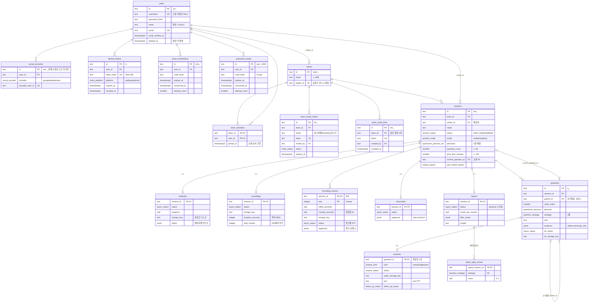

# Rehearsal.io — DB 스키마 (v1.1)

> **api-spec.md v0.3** + `infra/gpu-server/README.md` 기준. PostgreSQL 16.
> 작성일: 2026-07-11 · 최종 갱신: 2026-07-15 · 상태: **확정** — 마이그레이션 001~003 전부 반영. **테이블 18개 · ENUM 12종**.
> 스키마 원본은 [backend/migrations/](../backend/migrations/) (001_init → 002_recording_chunks → 003_password_resets). 이 문서와 어긋나면 마이그레이션 SQL이 진실이다.

---

## 0. 설계 결정 (합의 완료)

| # | 항목 | 결정 | 스키마 반영 |
|---|---|---|---|
| D1 | DBMS | **PostgreSQL 16** | 네이티브 ENUM, JSONB, 부분 유니크 인덱스 사용 |
| D2 | PK 전략 | **Prefix 문자열** (Stripe식, API ID와 동일) | `text` PK, 앱에서 `prefix_ + base62 랜덤(20자)` 생성 |
| D3 | 대용량 데이터 | **혼합** | slides·segments·evidence·filler_words = JSONB / 질문·답변·전략별 점수 = 테이블 |
| D4 | 회원 탈퇴 | **익명화** | `users` row 보존 + PII null화 + `deleted_at`. 팀 세션·Q&A 보존 (§7.1) |
| D5 | 팀장 이탈 | **자동 승계** | `joined_at` 최소(동률 시 `user_id`) 멤버가 승계, 마지막 1인이면 팀 삭제 (§7.2) |
| D6 | 인증 보조 | **전부 포함** | `refresh_tokens`, `email_verifications`, `password_resets`(003), `social_accounts`(스키마만 — 소셜 로그인은 최종 미구현) |

**ID prefix 규약**: `usr_ team_ inv_ lnk_ ses_ q_ soc_ rt_ emv_ pwr_` (1:1 자식 테이블은 부모 PK 재사용 — materials/recordings/transcripts/reports/answers는 별도 ID 없음. `recording_chunks`는 `(session_id, seq)` 복합 PK).

---

## 1. ERD



---

## 2. ENUM 정의

api-spec §6.1과 1:1 대응 (예외는 §5 매핑 표 참고).

```sql
CREATE TYPE client_platform    AS ENUM ('web', 'ios', 'android');
CREATE TYPE social_provider    AS ENUM ('google', 'kakao', 'naver');
CREATE TYPE invite_status      AS ENUM ('pending', 'accepted', 'declined', 'canceled');
CREATE TYPE session_status     AS ENUM ('draft', 'recording_in_progress', 'transcribing',
                                        'generating_questions', 'qna', 'completed', 'failed');
CREATE TYPE session_mode       AS ENUM ('realtime', 'upload');
CREATE TYPE questioner_persona AS ENUM ('egen', 'teto', 'kkondae', 'mungcheong', 'jammin');
CREATE TYPE question_strategy  AS ENUM ('detail_probe', 'big_picture', 'basic_concept',
                                        'numeric_verification');
CREATE TYPE async_status       AS ENUM ('queued', 'processing', 'ready', 'failed');
CREATE TYPE answer_status      AS ENUM ('processing', 'ready', 'failed');  -- 'pending'은 row 부재로 표현(§5)
CREATE TYPE answer_kind        AS ENUM ('answered', 'passed');
CREATE TYPE follow_up_status   AS ENUM ('pending', 'generated', 'none');
CREATE TYPE ended_reason       AS ENUM ('user_end', 'count_reached', 'timeout');
```

> `social_provider`는 스키마·모델에만 존재 — 소셜 로그인이 최종 미구현(Mock 엔드포인트)이라 런타임에서는 쓰이지 않는다.

---

## 3. DDL

### 3.1 유저 · 인증

```sql
CREATE TABLE users (
    id                text PRIMARY KEY,              -- 'usr_' || base62(20)
    username          text,                          -- 로그인 아이디 (소셜 전용 가입자는 NULL)
    password_hash     text,                          -- bcrypt/argon2 (소셜 전용은 NULL)
    name              text,                          -- 닉네임 (탈퇴 시 NULL → '탈퇴한 사용자' 표기)
    email             text,                          -- 탈퇴 시 NULL (재가입 허용)
    email_verified_at timestamptz,
    deleted_at        timestamptz,                   -- D4: 익명화 시각
    created_at        timestamptz NOT NULL DEFAULT now(),
    updated_at        timestamptz NOT NULL DEFAULT now(),
    CHECK (deleted_at IS NOT NULL OR name IS NOT NULL)   -- 활성 유저는 name 필수
);
-- 대소문자 무시 유니크 (NULL 다중 허용 → 탈퇴자와 충돌 없음)
CREATE UNIQUE INDEX users_username_key ON users (lower(username)) WHERE username IS NOT NULL;
CREATE UNIQUE INDEX users_email_key    ON users (lower(email))    WHERE email    IS NOT NULL;

CREATE TABLE social_accounts (
    id               text PRIMARY KEY,               -- 'soc_'
    user_id          text NOT NULL REFERENCES users(id) ON DELETE CASCADE,
    provider         social_provider NOT NULL,
    provider_user_id text NOT NULL,
    created_at       timestamptz NOT NULL DEFAULT now(),
    UNIQUE (provider, provider_user_id)              -- 같은 소셜 계정 재연결 금지
);
CREATE INDEX social_accounts_user_idx ON social_accounts (user_id);

CREATE TABLE refresh_tokens (
    id         text PRIMARY KEY,                     -- 'rt_'
    user_id    text NOT NULL REFERENCES users(id) ON DELETE CASCADE,
    token_hash text NOT NULL UNIQUE,                 -- SHA-256(token) — 원문 저장 금지
    platform   client_platform NOT NULL,             -- A1/B: web=쿠키, native=본문
    expires_at timestamptz NOT NULL,
    revoked_at timestamptz,                          -- 로그아웃/회전 시
    created_at timestamptz NOT NULL DEFAULT now()
);
CREATE INDEX refresh_tokens_user_idx ON refresh_tokens (user_id) WHERE revoked_at IS NULL;

CREATE TABLE email_verifications (
    id            text PRIMARY KEY,                  -- 'emv_'
    user_id       text NOT NULL REFERENCES users(id) ON DELETE CASCADE,
    code_hash     text NOT NULL,                     -- 인증코드 해시
    expires_at    timestamptz NOT NULL,
    consumed_at   timestamptz,
    attempt_count smallint NOT NULL DEFAULT 0,       -- 브루트포스 방지
    created_at    timestamptz NOT NULL DEFAULT now()
);
CREATE INDEX email_verifications_user_idx ON email_verifications (user_id) WHERE consumed_at IS NULL;

-- 003: 비밀번호 재설정 코드 (아이디·비밀번호 찾기).
-- email_verifications와 구조·규율이 같지만 테이블을 분리한다 — 한쪽은 "이메일 인증",
-- 한쪽은 "비밀번호 교체"로 목적이 달라, 공유하면 인증용 코드로 비밀번호를 바꾸는
-- 목적 혼동(confused deputy)이 생긴다. 코드 평문은 메일로만 나가고 DB엔 bcrypt 해시만.
CREATE TABLE password_resets (
    id            text PRIMARY KEY,                  -- 'pwr_'
    user_id       text NOT NULL REFERENCES users(id) ON DELETE CASCADE,
    code_hash     text NOT NULL,                     -- 재설정 코드 bcrypt 해시
    expires_at    timestamptz NOT NULL,
    consumed_at   timestamptz,
    attempt_count smallint NOT NULL DEFAULT 0,       -- 브루트포스 방지
    created_at    timestamptz NOT NULL DEFAULT now()
);
CREATE INDEX password_resets_user_idx ON password_resets (user_id) WHERE consumed_at IS NULL;
```

### 3.2 팀 · 멤버십 · 초대

```sql
CREATE TABLE teams (
    id         text PRIMARY KEY,                     -- 'team_'
    name       text NOT NULL CHECK (char_length(name) BETWEEN 1 AND 20),  -- 중복 허용(유니크 없음)
    leader_id  text NOT NULL REFERENCES users(id) ON DELETE RESTRICT,
    created_at timestamptz NOT NULL DEFAULT now(),
    updated_at timestamptz NOT NULL DEFAULT now()
);

CREATE TABLE team_members (
    team_id   text NOT NULL REFERENCES teams(id) ON DELETE CASCADE,
    user_id   text NOT NULL REFERENCES users(id) ON DELETE CASCADE,
    joined_at timestamptz NOT NULL DEFAULT now(),    -- D5: 승계 순서 기준
    PRIMARY KEY (team_id, user_id)
);
CREATE INDEX team_members_user_idx ON team_members (user_id);

-- 무결성: 팀장은 반드시 그 팀의 멤버 (팀 생성/승계 트랜잭션 커밋 시점에 검사)
ALTER TABLE teams
    ADD CONSTRAINT teams_leader_is_member_fk
    FOREIGN KEY (id, leader_id) REFERENCES team_members (team_id, user_id)
    DEFERRABLE INITIALLY DEFERRED;

CREATE TABLE team_email_invites (
    id           text PRIMARY KEY,                   -- 'inv_'
    team_id      text NOT NULL REFERENCES teams(id) ON DELETE CASCADE,
    email        text NOT NULL,
    token        text NOT NULL UNIQUE,               -- 메일 속 수락 링크용 (§3.1 /invites/{token})
    invited_by   text REFERENCES users(id) ON DELETE SET NULL,
    status       invite_status NOT NULL DEFAULT 'pending',
    expires_at   timestamptz NOT NULL,
    responded_at timestamptz,
    created_at   timestamptz NOT NULL DEFAULT now()
);
-- 같은 팀·같은 이메일 pending 중복 금지 (재초대는 기존 건 취소 후)
CREATE UNIQUE INDEX team_email_invites_pending_key
    ON team_email_invites (team_id, lower(email)) WHERE status = 'pending';

CREATE TABLE team_invite_links (
    id         text PRIMARY KEY,                     -- 'lnk_'
    team_id    text NOT NULL REFERENCES teams(id) ON DELETE CASCADE,
    token      text NOT NULL UNIQUE,
    created_by text REFERENCES users(id) ON DELETE SET NULL,
    expires_at timestamptz NOT NULL,
    revoked_at timestamptz,                          -- 회전/비활성화 시 (G: 이전 링크 즉시 무효)
    created_at timestamptz NOT NULL DEFAULT now()
);
-- api-spec §3.1: 팀당 활성 링크 1개 (회전 = 같은 트랜잭션에서 revoke + insert)
CREATE UNIQUE INDEX team_invite_links_active_key
    ON team_invite_links (team_id) WHERE revoked_at IS NULL;
```

### 3.3 세션 (발표 1회)

```sql
CREATE TABLE sessions (
    id                  text PRIMARY KEY,            -- 'ses_'
    team_id             text NOT NULL REFERENCES teams(id) ON DELETE CASCADE,
    owner_id            text NOT NULL REFERENCES users(id) ON DELETE RESTRICT,  -- F: 발표자(권한·성장리포트 축)
    name                text NOT NULL CHECK (char_length(name) BETWEEN 1 AND 50),
    status              session_status NOT NULL DEFAULT 'draft',
    mode                session_mode NOT NULL DEFAULT 'realtime',
    personas            questioner_persona[] NOT NULL CHECK (cardinality(personas) >= 1),  -- 중복선택(≥1)
    question_count      smallint NOT NULL CHECK (question_count BETWEEN 1 AND 20),  -- 1차 질문 수만(§4.1)
    time_limit_minutes  smallint NOT NULL CHECK (time_limit_minutes BETWEEN 1 AND 120),
    current_question_id text,                        -- FK는 §3.5에서 추가(순환 참조)
    qna_ended_reason    ended_reason,                -- A12: user_end > count_reached > timeout
    started_at          timestamptz,                 -- A9: 클라이언트 권위
    ended_at            timestamptz,
    created_at          timestamptz NOT NULL DEFAULT now(),
    updated_at          timestamptz NOT NULL DEFAULT now()
);
CREATE INDEX sessions_team_idx  ON sessions (team_id, created_at DESC);   -- 팀 페이지 목록
CREATE INDEX sessions_owner_idx ON sessions (owner_id, created_at DESC);  -- E: 성장 리포트(유저 스코프)
```

### 3.4 세션 자식 — 자료 · 녹음 · 녹음 청크 · 전사

> 1:1 관계(materials·recordings·transcripts)는 `session_id`를 그대로 PK로 사용 (별도 ID 불필요, 존재 여부 = "업로드/생성됨"). `recording_chunks`(002)만 1:N — `(session_id, seq)` 복합 PK.
> 파일 본문은 **VM 로컬 디스크**(A10 확정) — DB에는 `storage_key`(경로)만. `*_url`은 요청 시 서명 URL 발급.

```sql
CREATE TABLE materials (
    session_id      text PRIMARY KEY REFERENCES sessions(id) ON DELETE CASCADE,
    status          async_status NOT NULL DEFAULT 'queued',
    progress        real NOT NULL DEFAULT 0 CHECK (progress BETWEEN 0 AND 1),
    file_name       text NOT NULL,
    file_size_bytes integer NOT NULL CHECK (file_size_bytes <= 20 * 1024 * 1024),  -- §1.3: 20MB
    page_count      smallint CHECK (page_count <= 50),                             -- §1.3: 50p
    storage_key     text NOT NULL,
    slides          jsonb,                           -- ready 시: [{"page":1,"text":"..."}] (§6.1)
    error_code      text,                            -- 예: UNPROCESSABLE_PDF|PPTX (스캔본·이미지 덱)
    error_message   text,
    created_at      timestamptz NOT NULL DEFAULT now(),
    updated_at      timestamptz NOT NULL DEFAULT now()
);

CREATE TABLE recordings (
    session_id       text PRIMARY KEY REFERENCES sessions(id) ON DELETE CASCADE,
    status           async_status NOT NULL DEFAULT 'processing',  -- 업로드 완료 → ready
    file_name        text NOT NULL,
    file_size_bytes  integer NOT NULL CHECK (file_size_bytes <= 200 * 1024 * 1024),  -- §1.3: 200MB
    mime_type        text NOT NULL,                  -- audio/mpeg | audio/wav | audio/mp4
    duration_seconds integer NOT NULL CHECK (duration_seconds <= 3600),              -- §1.3: 60분
    storage_key      text NOT NULL,
    started_at       timestamptz,                    -- 클라이언트 보고값(A9)
    ended_at         timestamptz,
    created_at       timestamptz NOT NULL DEFAULT now()
);
-- 002: /recording/complete가 보고한 기대 청크 수 — 누락 seq 검출(0..total_chunks−1)용.
-- 일괄/파일 업로드 경로(§4.3)는 NULL로 남는다.
ALTER TABLE recordings ADD COLUMN total_chunks integer CHECK (total_chunks >= 0);

-- 002: 실시간 녹음 청크 (발표 중 60초 + 4초 **앞**겹침으로 순차 업로드, api-spec §4.3.1).
-- (session_id, seq) PK → 같은 seq 재전송은 upsert로 덮어써져 멱등. 청크별 STT 결과는
-- 청크-로컬 타임스탬프 그대로 segments에 쌓고, /recording/complete에서 오프셋 보정 +
-- 겹침 중점 절단으로 transcripts.segments에 병합한다.
CREATE TABLE recording_chunks (
    session_id       text NOT NULL REFERENCES sessions(id) ON DELETE CASCADE,
    seq              integer NOT NULL CHECK (seq >= 0),            -- 0-base 순번
    offset_seconds   real NOT NULL CHECK (offset_seconds >= 0),    -- 녹음 시작 기준 시작 오프셋(겹침 포함)
    overlap_seconds  real NOT NULL DEFAULT 0 CHECK (overlap_seconds >= 0),  -- 앞 청크와의 겹침(첫 청크 0)
    duration_seconds real NOT NULL CHECK (duration_seconds > 0),
    storage_key      text NOT NULL,
    status           async_status NOT NULL DEFAULT 'queued',       -- 청크별 STT 상태
    segments         jsonb,                             -- 청크-로컬 [{"start":..,"end":..,"text":..}]
    error_code       text,
    error_message    text,
    created_at       timestamptz NOT NULL DEFAULT now(),
    updated_at       timestamptz NOT NULL DEFAULT now(),
    PRIMARY KEY (session_id, seq)
);

CREATE TABLE transcripts (
    session_id    text PRIMARY KEY REFERENCES sessions(id) ON DELETE CASCADE,
    status        async_status NOT NULL DEFAULT 'queued',
    segments      jsonb,                             -- [{"start":12.0,"end":15.2,"text":"..."}] (§6.2)
    error_code    text,
    error_message text,
    created_at    timestamptz NOT NULL DEFAULT now(),
    updated_at    timestamptz NOT NULL DEFAULT now()
);
```

### 3.5 질문 · 답변

```sql
CREATE TABLE questions (
    id                text PRIMARY KEY,              -- 'q_'
    session_id        text NOT NULL REFERENCES sessions(id) ON DELETE CASCADE,
    parent_id         text REFERENCES questions(id) ON DELETE CASCADE,  -- 꼬리질문의 부모
    follow_up_depth   smallint NOT NULL DEFAULT 0 CHECK (follow_up_depth IN (0, 1)),  -- A11: 깊이≤1
    order_index       smallint NOT NULL,             -- 1차 질문 순번(1..N), 꼬리는 부모와 동일
    persona           questioner_persona NOT NULL,
    strategy          question_strategy NOT NULL,    -- C: 리포트 type_scores 집계 축
    text              text NOT NULL,
    evidence          jsonb NOT NULL DEFAULT '{"slides": [], "transcript_refs": []}',  -- §6.3
    tts_status        async_status NOT NULL DEFAULT 'queued',   -- A6: VoxCPM2 큐
    tts_storage_key   text,
    tts_error_code    text,
    tts_error_message text,
    created_at        timestamptz NOT NULL DEFAULT now(),
    CHECK ((parent_id IS NULL) = (follow_up_depth = 0))          -- 꼬리 ⟺ 부모 존재
);
-- 재생/표시 순서: ORDER BY order_index, follow_up_depth (꼬리는 부모 바로 뒤)
CREATE INDEX questions_session_idx ON questions (session_id, order_index, follow_up_depth);
-- 1차 질문 순번 유니크
CREATE UNIQUE INDEX questions_primary_order_key ON questions (session_id, order_index)
    WHERE parent_id IS NULL;
-- 질문당 꼬리질문 1개 (A11)
CREATE UNIQUE INDEX questions_one_follow_up_key ON questions (parent_id)
    WHERE parent_id IS NOT NULL;

-- sessions.current_question_id 순환 FK (질문 삭제 시 NULL)
ALTER TABLE sessions
    ADD CONSTRAINT sessions_current_question_fk
    FOREIGN KEY (current_question_id) REFERENCES questions(id)
    ON DELETE SET NULL DEFERRABLE INITIALLY DEFERRED;

CREATE TABLE answers (
    question_id       text PRIMARY KEY REFERENCES questions(id) ON DELETE CASCADE,  -- 질문당 답변 1개
    kind              answer_kind NOT NULL,          -- answered | passed(스킵, 로그 표시용)
    status            answer_status NOT NULL DEFAULT 'processing',  -- row 생성 = 제출 시점(§5 매핑)
    audio_storage_key text,                          -- passed면 NULL
    duration_seconds  integer,
    text              text,                          -- raw STT 원문(v0.3 — 정제 없음)
    follow_up_status  follow_up_status NOT NULL DEFAULT 'pending',  -- A: 꼬리질문 판정 상태
    error_code        text,                          -- STT_FAILED 등 → 재제출로 재시도
    error_message     text,
    submitted_at      timestamptz NOT NULL DEFAULT now(),
    updated_at        timestamptz NOT NULL DEFAULT now(),
    -- 패스는 오디오 없음 + 꼬리질문 생략(§4.4)
    CHECK (kind <> 'passed' OR (audio_storage_key IS NULL AND follow_up_status = 'none'))
);
```

### 3.6 리포트

```sql
CREATE TABLE reports (
    session_id       text PRIMARY KEY REFERENCES sessions(id) ON DELETE CASCADE,
    status           async_status NOT NULL DEFAULT 'queued',   -- A7: qna/end 시 자동 생성
    words_per_minute real,                           -- 콘텐츠 기준(간투사 제외, 팀 결정 2026-07-13): 원문 transcript에서 필러 어절 빼고 집계
    filler_words     jsonb,                          -- [{"word":"음","count":9}] (§6.4)
    insight          text,
    error_code       text,
    error_message    text,
    created_at       timestamptz NOT NULL DEFAULT now(),
    updated_at       timestamptz NOT NULL DEFAULT now()        -- report/generate 재생성 시 갱신
);
-- time_limit_seconds/actual_seconds/over_time은 저장하지 않음 — sessions·recordings에서 파생(§5)

-- D3: 전략별 점수는 정규화 — 성장 리포트가 SQL 한 방(§8.1)
CREATE TABLE report_type_scores (
    report_session_id text NOT NULL REFERENCES reports(session_id) ON DELETE CASCADE,
    strategy          question_strategy NOT NULL,
    score             real NOT NULL CHECK (score BETWEEN 0 AND 1),
    PRIMARY KEY (report_session_id, strategy)
);
```

### 3.7 `updated_at` 자동 갱신 (공통 트리거)

```sql
CREATE OR REPLACE FUNCTION set_updated_at() RETURNS trigger AS $$
BEGIN NEW.updated_at = now(); RETURN NEW; END $$ LANGUAGE plpgsql;

-- updated_at 보유 테이블 전부에 부착:
-- users, teams, sessions, materials, transcripts, answers, reports (+ recording_chunks는 002에서)
DO $$
DECLARE t text;
BEGIN
    FOREACH t IN ARRAY ARRAY['users','teams','sessions','materials','transcripts','answers','reports']
    LOOP
        EXECUTE format('CREATE TRIGGER %I_updated_at BEFORE UPDATE ON %I
                        FOR EACH ROW EXECUTE FUNCTION set_updated_at()', t, t);
    END LOOP;
END $$;

-- 002에서 recording_chunks에도 동일 트리거 부착:
CREATE TRIGGER recording_chunks_updated_at BEFORE UPDATE ON recording_chunks
    FOR EACH ROW EXECUTE FUNCTION set_updated_at();
```

---

## 4. API 리소스 ↔ 테이블 매핑

| API (v0.3) | 테이블 | 비고 |
|---|---|---|
| `/auth/signup·login·refresh·logout` | `users`, `refresh_tokens` | refresh는 해시만 저장 |
| `/auth/email/verify-request`, `/auth/email/verify` | `email_verifications` | SMTP 실발송(`EMAIL_PROVIDER=smtp`) / mock은 서버 로그 출력 |
| `/auth/username/find`, `/auth/password/reset-request·reset` | `password_resets` | 코드는 bcrypt 해시만 저장 (003) |
| ~~`/auth/login/{provider}`~~ | `social_accounts` | **소셜 로그인 미구현** — Mock 응답만, 테이블 런타임 미사용 |
| `/users/me` | `users` | 탈퇴 = 익명화(§7.1) |
| `/teams*`, `/teams/{id}/members` | `teams`, `team_members` | 팀장 = `teams.leader_id` |
| `/teams/{id}/invites*` (이메일) | `team_email_invites` | pending 부분 유니크 |
| `/teams/{id}/invites/link` | `team_invite_links` | 활성 1개 부분 유니크 (G) |
| `/invites/{token}/*` | 두 초대 테이블 `token` 컬럼 | 이메일·링크 공용 진입점 |
| `/teams/{id}/sessions`, `/sessions/{id}` | `sessions` | `owner_id`(F), `personas` enum[] |
| `/sessions/{id}/material` (+`/retry`) | `materials` | slides = JSONB |
| `/sessions/{id}/recording`, `/recording/start·complete` | `recordings` | 파일은 로컬 디스크, `total_chunks`로 누락 검출 |
| `/sessions/{id}/recording/chunks` | `recording_chunks` | `(session_id, seq)` upsert = 멱등 재전송 (002) |
| `/sessions/{id}/transcript` (+`/retry`) | `transcripts` | segments = JSONB(초 단위) |
| `/sessions/{id}/qna*` (generate·answer·pass·end) | `questions`, `answers` | 꼬리질문 = self-FK |
| `/sessions/{id}/report` (+`/generate`) | `reports` + `report_type_scores` | 점수 정규화(C) |
| `/users/me/report/growth` | (질의 — §8.1) | 저장 테이블 없음 |

---

## 5. API 응답 필드 ↔ 컬럼 매핑 (파생 규칙)

DB에 저장하지 않고 **서빙 시 파생**하는 값들:

| API 필드 | 파생 방법 |
|---|---|
| `answer.status = "pending"` | `answers` row **부재** (제출 전). row 생성 후엔 enum 그대로 |
| `*_url` (audio/tts) | `storage_key` → 요청 시 서명 URL 발급(A10) |
| `transcript.segments[].ts` (`"04:12"`) | `segments[].start`(초 float) → `MM:SS` 포맷 |
| `evidence.transcript_refs[].ts` | JSONB에는 `{"start": 252.0}`(초) 저장 → API에서 포맷 (§6.3) |
| `report.time_limit_seconds` | `sessions.time_limit_minutes * 60` |
| `report.actual_seconds` | `recordings.duration_seconds` |
| `report.over_time`, `filler_word_count` | 클라이언트/서버 파생 (v0.3 §5.2와 동일) |
| `answer_quality.strong/weak_types` | `report_type_scores` 임계값 분류(저장 안 함) |
| `qna.status` (`in_progress·ended`) | `sessions.status` (`qna` → in_progress, `completed` → ended) |
| 팀 카드의 `발표 N회`, 멤버 미리보기 | `COUNT(sessions)`, `team_members` 조인 |

---

## 6. JSONB 스키마 (혼합 전략 D3)

### 6.1 `materials.slides` — slides.json
```json
[ { "page": 1, "text": "표지 — Rehearsal.io" }, { "page": 2, "text": "문제 정의 …" } ]
```

### 6.2 `transcripts.segments` — transcript.json (STT 서버 반환 형식과 동일)
```json
[ { "start": 12.0, "end": 15.2, "text": "안녕하세요, 어… 오늘 발표를 맡은 박준서입니다." } ]
```
> `infra/gpu-server` STT `/transcribe` 응답의 `segments[{text,start,end}]`를 **그대로 저장**(초 단위 float).
> **실시간 모드**: FE가 보낸 60초+4초 앞겹침 청크(`recording_chunks.segments`)를 `/recording/complete`에서 오프셋 보정 + 겹침 중점 절단으로 병합해 저장.
> **업로드 모드**: 백엔드(`stt.py`)가 파일을 60초+4초 뒤겹침 청크로 직접 분할·직렬 전사 후 병합(ForcedAligner 5분/건 제약의 충분히 안쪽).

### 6.3 `questions.evidence`
```json
{ "slides": [3], "transcript_refs": [ { "start": 252.0 } ] }
```
> API의 `ts:"04:12"`는 서빙 시 포맷. 슬라이드 번호는 `materials.slides[].page` 참조(느슨한 참조 — 자료 삭제 시에도 질문 로그 보존).

### 6.4 `reports.filler_words`
```json
[ { "word": "음", "count": 9 }, { "word": "어", "count": 5 } ]
```

---

## 7. 라이프사이클 절차 (앱 레벨 트랜잭션)

### 7.1 회원 탈퇴 = 익명화 (D4)

`DELETE /users/me` 시 **단일 트랜잭션**:

1. 소속 각 팀에 대해 **팀장이면 승계**(§7.2), 팀장 아니면 그냥 진행
2. `DELETE FROM team_members WHERE user_id = :me` (팀 활동 종료)
3. `DELETE FROM social_accounts …` / `UPDATE refresh_tokens SET revoked_at = now() …`
4. `UPDATE users SET username=NULL, password_hash=NULL, name=NULL, email=NULL, deleted_at=now() WHERE id=:me`
5. **보존**: 본인이 owner인 세션·녹음·Q&A·리포트 → 팀 자산으로 유지(owner는 "탈퇴한 사용자"로 표기)

> `sessions.owner_id ON DELETE RESTRICT`: users row는 절대 하드삭제되지 않으므로 실질 미발동 — 실수 방어용.

### 7.2 팀장 이탈 자동 승계 (D5)

`POST /teams/{id}/leave` 또는 탈퇴 시 팀장이라면, 같은 트랜잭션에서:

```sql
-- 1) 후임 선출: 본인 제외 최고참 ($1 = team_id, $2 = 나)
SELECT user_id FROM team_members
WHERE team_id = $1 AND user_id <> $2
ORDER BY joined_at, user_id LIMIT 1;
-- 2-a) 후임 있음 → UPDATE teams SET leader_id = <successor>; DELETE 멤버십
-- 2-b) 후임 없음(마지막 1인) → DELETE FROM teams WHERE id = <team>  (세션 등 전부 CASCADE)
```
> `teams_leader_is_member_fk`(DEFERRABLE)가 커밋 시점에 "팀장 ∈ 멤버"를 강제 — 승계 누락 버그를 DB가 차단.

### 7.3 삭제 cascade 요약 (api-spec §4.1 확정 반영)

| 삭제 대상 | DB cascade | 오브젝트 스토리지(앱 책임) |
|---|---|---|
| 세션 | materials → recordings(+recording_chunks) → transcripts → questions(+answers) → reports(+type_scores), `current_question_id` SET NULL | 자료(PDF·PPTX)·발표녹음·청크 오디오·질문TTS·답변오디오 파일 삭제 |
| 팀 | sessions 전체(위 연쇄 포함) + 멤버십 + 초대 | 위 전체 |
| 질문(꼬리 포함) | 자식 꼬리질문·답변 | TTS·답변 오디오 |
| 유저(탈퇴) | **cascade 없음** — 익명화(§7.1) | 없음(세션 보존) |

> DB CASCADE는 스토리지 파일을 지우지 못함 → 삭제 API는 **storage_key 목록을 먼저 수집 후 커밋, 커밋 성공 시 스토리지 삭제**(실패분은 주기 청소 배치).

---

## 8. 대표 쿼리

### 8.1 성장 리포트 (E: 유저 스코프, `GET /users/me/report/growth`)

```sql
-- $1 = 나(owner), $2 = team_id 필터(선택, NULL이면 전체)
SELECT s.id AS session_id, s.name, s.ended_at::date AS date,
       rts.strategy, rts.score
FROM sessions s
JOIN report_type_scores rts ON rts.report_session_id = s.id
WHERE s.owner_id = $1
  AND s.status = 'completed'
  AND ($2::text IS NULL OR s.team_id = $2)
ORDER BY s.ended_at, rts.strategy
LIMIT 20;   -- range=recent5 → 세션 5개 × 전략 4종
```

### 8.2 Q&A 화면 (`GET /sessions/{id}/qna` — 표시 순서)

```sql
SELECT q.*, a.kind, a.status AS answer_status, a.text AS answer_text, a.follow_up_status
FROM questions q
LEFT JOIN answers a ON a.question_id = q.id
WHERE q.session_id = $1
ORDER BY q.order_index, q.follow_up_depth;   -- 꼬리질문은 부모 바로 뒤
```

### 8.3 메인 페이지 팀 카드 (`GET /teams`)

```sql
SELECT t.id, t.name,
       (SELECT count(*) FROM sessions s WHERE s.team_id = t.id)             AS session_count,
       (SELECT string_agg(coalesce(u.name, '탈퇴한 사용자'), ', ' ORDER BY m2.joined_at)
        FROM team_members m2 JOIN users u ON u.id = m2.user_id
        WHERE m2.team_id = t.id)                                            AS members_preview
FROM teams t
JOIN team_members m ON m.team_id = t.id AND m.user_id = $1
ORDER BY t.created_at DESC;
```

---

## 9. 미결정이었던 항목 — 최종 처리 결과

| 항목 | 최종 상태 | 스키마 영향 |
|---|---|---|
| 데이터 보관 정책(A10) | **무기한 보관으로 종료** — 별도 정책 미도입 | 없음 (도입했다면 `recordings.expires_at` 등 + 청소 배치) |
| ~~WPM에서 필러 제외 여부(v0.3 §5.2)~~ | **결정·구현: 제외(2026-07-13)** | 완료 — §3.6 주석 갱신, `compute_speaking_metrics(exclude_fillers=True)` |
| TTS 재생성 정책(§8) | 재생성 API 미도입 — 서버 재시작 시 미완료 TTS 잡 자동 복구(`qna_jobs.recover_tts`)로 처리 | 없음 |
| `personas` 배열 중복값 | 앱에서 dedupe로 종료 | DB CHECK 미강제(단순화) |
| 레이트리밋/쿼터 | **미도입으로 종료** | 없음 |

---

## 부록 A. 테이블 목록 (18개)

| 도메인 | 테이블 |
|---|---|
| 유저·인증 (5) | `users`, `social_accounts`, `refresh_tokens`, `email_verifications`, `password_resets` |
| 팀 (4) | `teams`, `team_members`, `team_email_invites`, `team_invite_links` |
| 세션 (5) | `sessions`, `materials`, `recordings`, `recording_chunks`, `transcripts` |
| Q&A·리포트 (4) | `questions`, `answers`, `reports`, `report_type_scores` |

> 마이그레이션 이력: `001_init.sql`(16개) → `002_recording_chunks.sql`(+`recording_chunks`, `recordings.total_chunks` 컬럼) → `003_password_resets.sql`(+`password_resets`)
